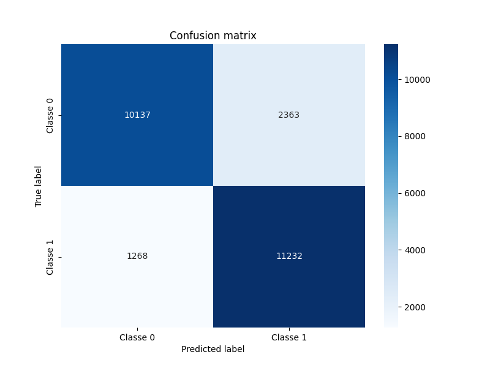
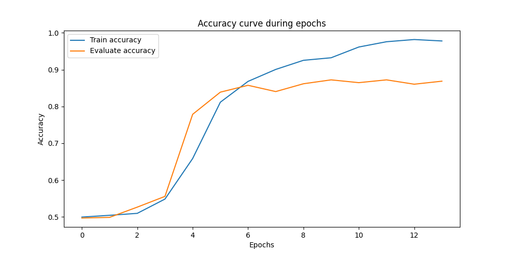
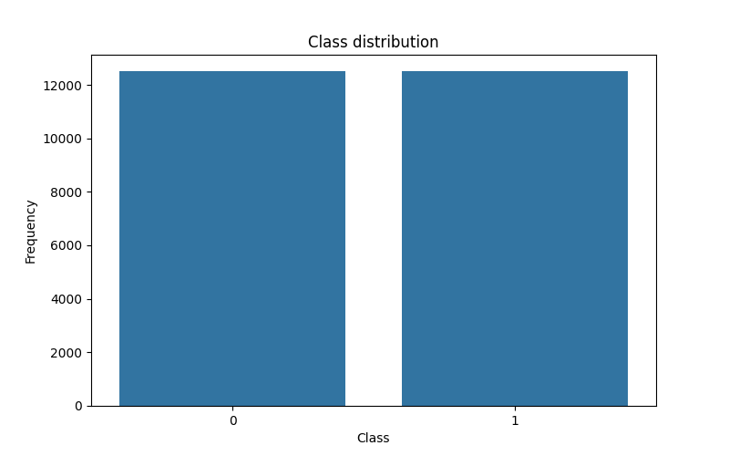
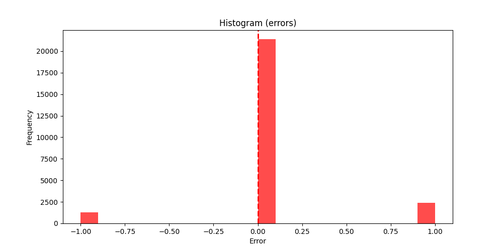

# Sentiment Analyzer

This project implements a sentiment analyzer using Long Short-Term Memory (LSTM) neural networks. It contains three versions that utilize different libraries and datasets:

1. **SentimentAnalyzer.ipynb**: Uses over 25,000 positive and negative review samples with Keras.
2. **SentimentAnalyzer_torch.ipynb**: Implements the same analysis using PyTorch.
3. **SentimentAnalyzerIMDB.py**: Uses the IMDb dataset with PyTorch.

## Dependencies

This project was developed with the following libraries:

- NumPy
- Keras
- PyTorch
- Matplotlib
- Scikit-learn

## Graphs (IMDB Version)

